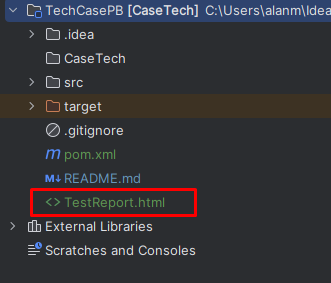

# Case Técnico QA 2023 - Paraná Banco

O projeto apresentado tem como objetivo solucionar os itens propostos dentro do case técnico.


## Autor

- [@Zegnet](https://www.github.com/Zegnet)


## 1 - Cenário de Teste - Perguntas e Respostas

Imagina que você iniciou em uma equipe com um projeto do Zero. A proposta do projeto é a criação de uma solução para realizar compra de imóveis através de sistemas que facilitarão a comunicação de imobiliárias, clientes e bancos. A arquitetura está sendo desenhada a partir de solução de microsserviços e WebSites, está sendo mapeado integrações com sistemas externos, espera-se volume alto de operação uma vez que o sistema irá operar em todo o território Brasileiro, o cliente está bem próximo do projeto para levantamento de requisitos.

1. **Dado esse cenário, como você iniciaria uma estratégia de teste?**
    * Considerando que o levantamento de requisitos já foi realizado. Atuar na identificação das features a serem desenvolvidas e com base nestas elencar features de teste;
    * Definir práticas de teste, padrões e stack para desenvolvimento de automação de testes (alinhar junto a definição da stack desenvolvimento);
    * Atuar em conjunto ao time na etapa de backlog planning para pontuação das features e classificação de complexidades de teste, prioridade e entregas de valor;
    * Construir cenários de testes manuais classificando-os;
    * Definir stage de testes automatizados para integração contínua e entrega contínua;
    * Construir testes automatizados.
2. **Quais abordagens de teste você consideraria?**
    * Com objetivo de acompanhar as features e entregas de valor realizadas por desenvolvimento aplicaria como prática de testes os conceitos do shift-left testing;
    * Utilização de virtualização de serviços para uma abordagem de desenvolvimento de testes automatizados continuos e até mesmo para agilizar o desenvolvimento do WebSite ainda com o back-end em construção (considerando a utilização de um serviço de virtualização a utilização de mocks não seria necessária);
    * Práticas de consumer-driven considerando a aplicação de testes de contrato;
    * Aplicação de práticas de TDD para testes unitários e BDD para desevolvimento de testes integrados e preparação para features automatizadas.
3. **Como você trabalharia com diferentes tipos/níveis de teste?**
    * Considerando as abordagens apresentadas os níveis de teste seriam divididos e 3 (três) fases principais:
        * Integração;
        * Entrega;
        * Implatantação.

      Níveis em cada fase:

        * Integração
            * Testes Unitários;
            * Testes de Contrato;
            * Integração e Componente.
        * Entrega
            * Testes Ponta à Ponta (End-to-end);
            * Testes de Performance.
        * Implatantação
            * Testes de Fumaça (SmokeTest);
            * Testes Regressivos.
4. **Quais ferramentas você consideraria usar?**
    * As ferramentas para aplicação dos testes iriam variar de acordo com a fase e com a stack de desenvolvimento (Considerando testes automatizados), porém poderiam ser:
        * Testes de Integração: SuperTest, JestFramework ou RestAssured;
        * Teste de Perfomance: LoadRunner;
        * Teste de Contrato: RestAssured, JestFramework ou Postman (Integrando o newman na pipeline de testes);
        * Testes Regressivos: Cypress ou Selenium.
5. **Como você se imagina atuando nessa equipe?**
    * Como Engenheiro de Qualidade, Automatizador ou até mesmo no papel de Líder Técnico geral de Automação.


## Cenários de Teste

Para o desenvolvimento de cenários de teste estarei seguindo o modelo de abordagens de teste demonstrada nas perguntas anteriores, dividos em 3 (três) etapas:
* Integração;
* Entrega;
* Implantação.

**Integração**

Cenário: Autenticação de usuários<br />

Dado que desejo realizar autenticação da plataforma de busca de imóveis.<br />
Quando preencho os campos do formulário de autenticação com os dados válidos.<br />
Então é apresentada página inicial.<br /><br />

Cenário: Validação de Score do cliente no Serasa<br />

Dado que um cliente deseja comprar um imóvel na plataforma. <br />
Quando preencho os campos do formulário de autenticação com os dados solicitados. <br />
Então sistema busca informação de score no Serasa para validação de fatores de risco. <br /><br />

**Entrega**

Cenário: Finalização do processo de compra de um imóvel<br />

Dado que desejo comprar o imóvel XPTO.<br />
E adicionei o imóvel XPTO no carrinho de compras.<br />
Quando preencho as informações de compra.<br />
E clico no botão de finalização de compra<br />
Então é apresentada tela de sucesso no processo de finalização de compra pela plataforma.<br /><br />


**Implantação**

(Cenários integrados e classificados em outras etapas também podem ser reaproveitados nesta etapa)

Cenário: Busca de imóveis utilizando filtros customizados<br />

Dado que desejo comprar o imóvel XPTO.<br />
Quando pesquiso o imóvel considerando características de cidade, valor, quantidade de comôdos.<br />
Então é apresentado resultado de busca considerando os filtros informados.<br /><br />

## 2 - Automação de Testes


## Documentação

**Bibliotecas e Linguagens**

    * Maven 3.9.4 [Download](https://maven.apache.org/download.cgi)
    * JDK 20 [Download](https://www.oracle.com/java/technologies/downloads/#jdk20-windows)
    * Selenium WebDriver 4.11.0
    * RestAssured 5.3.1
    * WebDriverManager 5.5.3
    * ExtentReports 5.0.9
    * Java 20

**Patterns e Conceitos**

    * SOLID;
    * Singleton;
    * PageObject;
    * Factory.

**Configuração JDK**

    * Realizar o download da versão do JDK 20 (versão que o projeto foi construído, caso utilize versões anteriores o projeto pode não funcionar corretamente)
    * Acessar variáveis de ambiente da máquina;
    * Criar variável "JAVA_HOME" na seção "Variáveis de Sistema"
        * Nome da variável: "JAVA_HOME";
        * Valor da variável: C:\Program Files\Java\jdk-20 (O caminho pode variar caso o download da versão x86 tenha sido realizada. Necessário observar a arquitetura da CPU)
    * Após criação da variável "JAVA_HOME" acessar a variável "PATH" da seção "Variáveis de Sistema"
    * Acrescentar um novo valor seguindo o padrão ao lado: %JAVA_HOME%\bin (Apontamento necessário para identificação da JVM no sistema operacional)

**Configuração MAVEN**

    Para apresentar o passo à passo da configuração do maven, estou considerando a utilização da versão 3.9.4

    * Realizar o download da versão do MAVEN especifica (ou inferior);
        * Observação: Realizar o download do "Binary zip archive".
    * Extrair arquivo dentro do diretório raiz da máquina (C:);
    * Criar variável "MAVEN_HOME" na seção "Variáveis de Sistema"
        * Nome da variável: "MAVEN_HOME";
        * Valor da variável: C:\apache-maven-3.9.4 (O nome da pasta pode variar de acordo com a extração realizada e versão do maven que foi realizado download) 
    * Após criação da variável "MAVEN_HOME" acessar a variável "PATH" da seção "Variáveis de Sistema"
    * Acrescentar um novo valor seguindo o padrão ao lado: %MAVEN_HOME%\bin (Apontamento necessário para identificação dos arquivos binários do maven)

**Validação da instalação**

Para validar se a instalação/configuração foi realizada com sucesso, abrir o CMD como administrador e digitar os comandos abaixo:

    * Validação da JVM: java --version
        * Caso seja apresentado a versão do "Server VM" então a configuração foi realizada corretamente.
    * Validação do MAVEN: mvn --version
        * Caso seja apresentado a versão do "Apache Maven" então configuração foi realizada com sucesso.


**Execução do Projeto via CLI**

Devido a utilização de uma ferramenta de gestão de ciclo de vida e dependências para aplicações em JAVA torna-se possível a execução do projeto através da linha de comando abaixo.

```
mvn test -Dtest=Runner
```

Observação: Importante garantir que a aplicação de linha de comando esteja aberta no diretório do projeto

**Visualização do Relatório do Teste HTML**

Após realizar a execução do teste automatizado é possível visualizar o ECT (Evidência do caso de teste) acessando o arquivo com o nome "TestReport.html" (Vide imagem abaixo)<br />



**Estrutura do Projeto**

Para o desenvolvimento do case técnico foi utilizada uma arquitetura componentizada juntamente com a construção de um mini framework para diminuição da complexidade ciclomática do código garantindo assim, uma fácil manutenabilidade das **páginas**, **atributos** e **requests das APIs**. Abaixo segue um desenho demonstrando a divisão de pastas e arquitetura:

```
src
|___main
    |___java
        |___engine
            |___API
                |__Utils
            |___Web
                |__Driver
                |__Utils

    |___test
        |___java
            |___API
                |__Statements
                |__Requests
            |___Web
                |__Pages
                |__Attributes
        |___resources
```

**Descrição do Pacote Engine**

Para a estruturação do core e funcionamento escalável dos testes automatizados, temos o pacote **"engine"** que representa o mini framework desenvolvido. Este pacote é estruturado por interfaces de funções de utilidade, classes abstratas e factories.

**Interface Utilitários (Utils):** Está interface contém métodos de utilidade, ou seja, cliques, métodos post, métodos get e validações.

**Classe Driver:** A classe Driver é responsável por gerenciar a instância e alocação de memória para execução dos testes funcionais. (Para gerenciamento automático do browser utilizei o WebDriverManager)

**Interface DriverBase:** Essa interface é responsável por criar um contrato único para criação de drivers dentro do projeto, ou seja, hoje a configuração de driver está apenas direcionada para o Google Chrome, porém este contrato permite a criação e padronização de maneira fácil de novos drivers para teste, como, drivers de banco de dados, aplicações de linha de comando, InsightObjects entre outros, garantindo assim uma maior cobertura de automação não importando a tecnologia utilizada para o desenvolvimento da aplicação.

**Reporter:** A classe reporter é responsável por gerar uma instância única para publicação e gerenciamento do relatório de testes gerado ao fim da execução da "Runner". Essa classe é responsável por gerar o relatório no formato HTML.

**ScenarioBase:** Classe de definição de estrutura para gerenciamento de TestNames entre outros recursos. Através dessa classe, podemos gerar uma sobrecarga dos métodos de controle do JUnit permitindo um apresentação de relatório customizado ao final da execução independente dos status do teste.


**Descrição do Pacote Test**

O pacote test, como propriamente especificado, trata-se do diretório onde os testes, objetos e requests estão mapeados, ou seja, é neste pacote que possuímos todos os testes propostos no Case Técnico.

**Pages:** Neste pacote temos as classes que representam as páginas acessadas da aplicação.<br />
**Attributes:** Neste pacote temos a fábrica de objetos da respectiva página do sistema.<br />

Observação: Para cada página do sistema temos uma classe "Page" e uma "Attributes".<br /><br />

**Requests:** Contém todas as classes, separadas por microserviço ou interface de comunicação, onde todas as requests estão criadas.<br />
**Statements:** Contém toda a lógica de validação das requests mapeadas nas classes "Requests".<br />

Observação: Para cada microserviço/endpoint/interface de comunicação temos uma classe "Request" e uma "Statement".<br /><br />


Diante dessa arquitetura é possível notar o uso do conceito de Single Responsability, onde as responsabilidades de classe são claras e objetivas, gerando assim, um maior controle e manutenabilidade.


Criado por: Alan Marques
